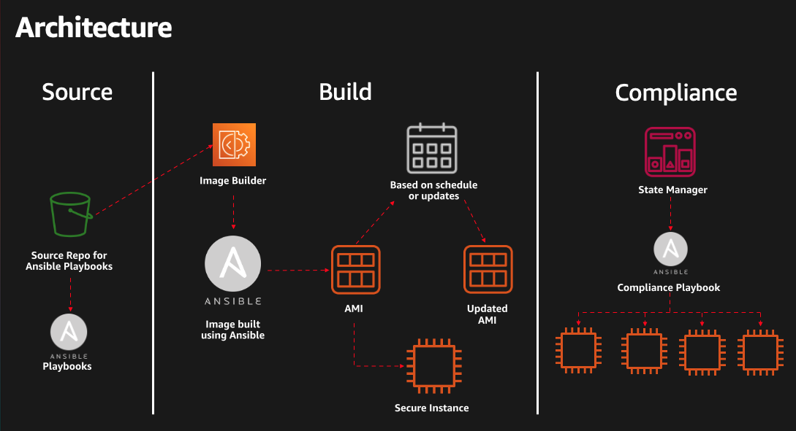

# Dev Days Ansible Compliance Session
This repository has the code related to the Session "Enabling Cloud Native Compliance Using Ansible"

This repo includes ec2 image Builder and Systems Manager and cloudformation resources

Architecture presented in the session

# ec2 Image Builder

## Ansbile Component Config
[ec2Image Builder - Ansible Component](ec2imagebuilder.yaml)

Note: make sure you replace the **bucketname** and **prefix** with your bucket and prefix details

## Cloudformation
[ec2Image Builder - Pipeline](/cloudformation/ec2imagebuilderpipeline.yaml)

Use this CFN templace to build an ec2 image builder pipeline based on an Ansible Component

Note: This template will also deploy the Ansible Component Above. make sure you replace the **bucketname** and **prefix** with your bucket and prefix details

# Systems Manager - State Manager

Zip file for the Ansible Playbook Association

[State Manager - Association](automation.zip)
